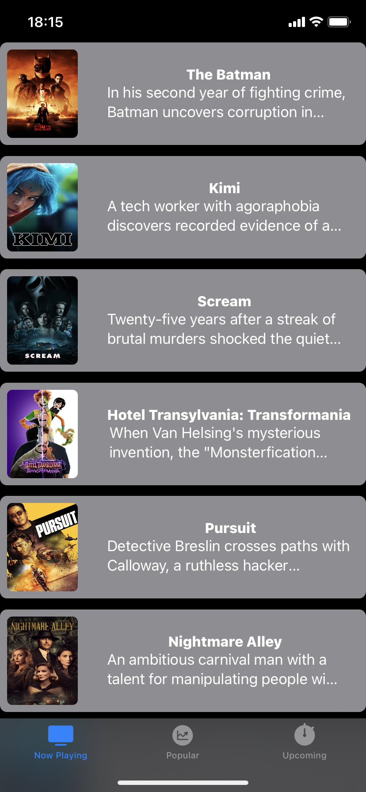
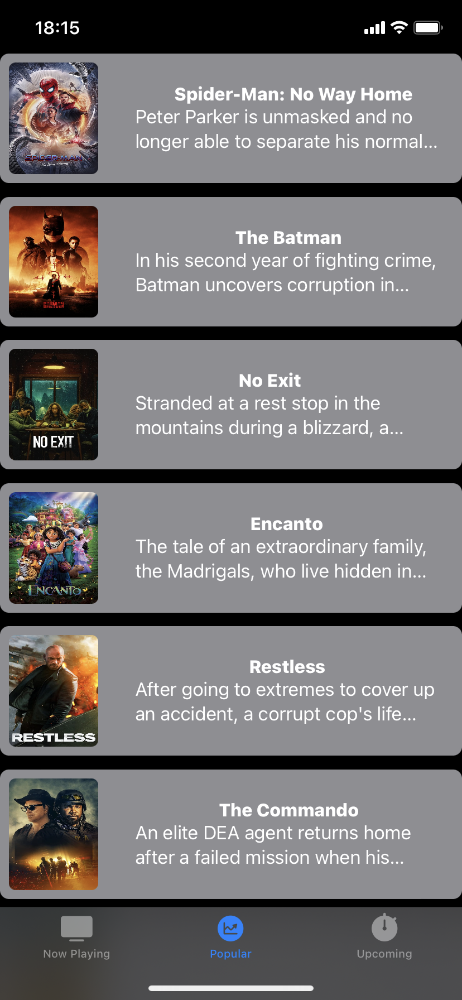
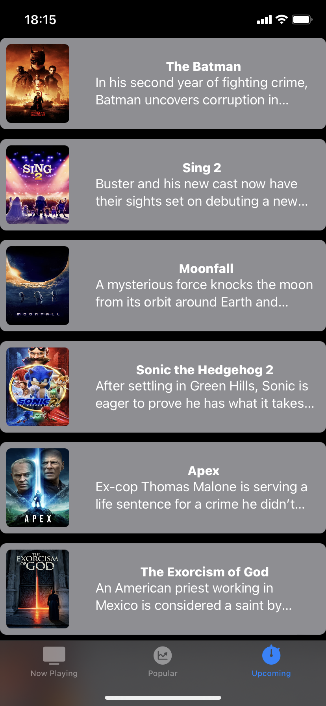

# NextFlix-SwiftUI

This is a PoC that show use of swiftUI in Swift.

## Screenshots

 
 
 

## Tech Stack

* Swift
* SwiftUI
* Alamofire

## Screens
* [Click here to Now Playing Screen](https://github.com/tfaki/NextFlix-SwiftUI/blob/main/NextFlix-Swift/Features/NowPlaying/NowPlayingView.swift)
* [Click here to Popular Screen](https://github.com/tfaki/NextFlix-SwiftUI/blob/main/NextFlix-Swift/Features/Popular/PopularView.swift)
* [Click here to Upcoming Screen](https://github.com/tfaki/NextFlix-SwiftUI/blob/main/NextFlix-Swift/Features/Upcoming/UpcomingView.swift)

## Did you find this repository helpful?
Don't forget give a star.

## Didn't you?
Then fork this repo, make it better and don't forgot give a STAR.
